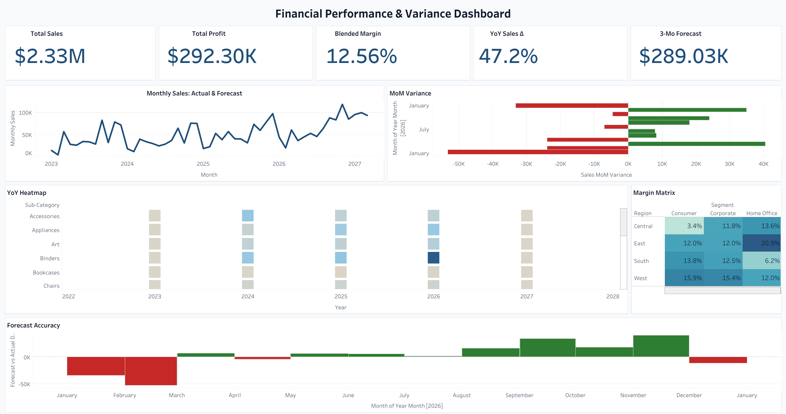
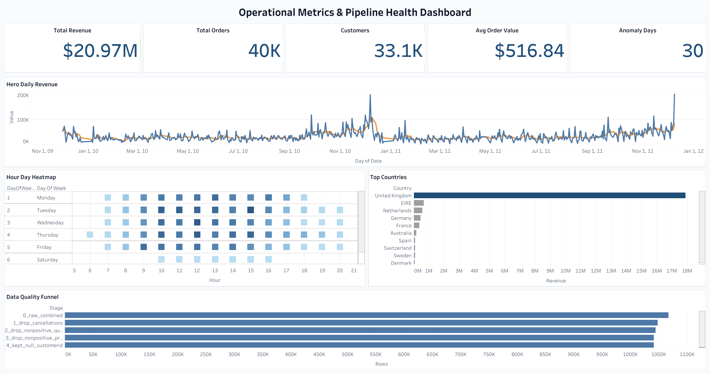

<div align="center">


<a href="https://github.com/steadysuccess22-sudo/apple-dashboards-portfolio">
  
</a>

<br>

[](https://public.tableau.com/views/dashboard1_financial_variance/FinancialPerformanceVarianceDashboard)
[](https://public.tableau.com/views/dashboard2_operational_metrics/OperationalMetricsPipelineHealthDashboard)
[](https://public.tableau.com/app/profile/phanindra.ram/vizzes)

<br>


<br>

### 📊 Click a dashboard to open it live

[](https://public.tableau.com/views/dashboard1_financial_variance/FinancialPerformanceVarianceDashboard) [](https://public.tableau.com/views/dashboard2_operational_metrics/OperationalMetricsPipelineHealthDashboard)

</div>

---

## TL;DR

I built two production-quality Tableau dashboards on real public datasets, end-to-end, in a week. A CFO can walk up to Dashboard 1 and have the headline in five seconds. An ops lead can walk up to Dashboard 2 and answer the next three questions before their coffee gets cold. Everything you see here — the metric definitions, the chart choices, the color encoding, the data-quality story — is mine. AI did the parts of the job that don't show judgment so I could spend my time on the parts that do.

This is the portfolio I'm submitting for **Apple's Data Analyst & AI Automation Specialist position**.

> [!TIP]
> **Hiring manager? 60-second tour:**
> 1. Open the two live dashboards above. Read the KPI row.
> 2. Skim [How I built this](#-how-i-built-this) for the human-vs-AI labor split.
> 3. Skim [Decisions I'd defend in a review](#️-decisions-id-defend-in-a-review).

---

## Table of contents

- [Dashboard 1 — Financial Performance & Variance](#-dashboard-1--financial-performance--variance)
- [Dashboard 2 — Operational Metrics & Pipeline Health](#-dashboard-2--operational-metrics--pipeline-health)
- [How I built this](#-how-i-built-this)
- [Designed for non-technical readers](#-designed-for-non-technical-readers)
- [Decisions I'd defend in a review](#️-decisions-id-defend-in-a-review)
- [Try it yourself](#-try-it-yourself)
- [Repo layout](#-repo-layout)
- [Honest about limits](#-honest-about-limits)
- [Author](#-author)

---

## 📊 Dashboard 1 — Financial Performance & Variance

**Dataset:** Tableau's Sample-Superstore — 10,194 rows × 21 columns, January 2023 through December 2026.
**Question it answers:** Where are we vs. plan, and which segments are quietly dragging margin?

<div align="center">

| Total Sales | Total Profit | Blended Margin | YoY Sales Δ | 3-Mo Forecast |
|:---:|:---:|:---:|:---:|:---:|
| **$2.33M** | **$292K** | **12.56%** | **+47.2%** | **$289K** |

</div>

What the data told me, in order:

- **East × Home Office prints 20.9% margin. Central × Consumer prints 3.4%.** Same company, same year. The margin matrix is the chart I'd put in front of a regional VP first.
- **Fasteners are up 515% YoY in 2026.** Tiny category, but the slope is the loudest signal on the YoY heatmap.
- **Binders, Tables, and Machines are structurally loss-making across the four-year window.** Not noise. Pattern.

<details>
<summary><b>Open: build notes for Dashboard 1</b></summary>

- **10 worksheets:** 5 KPI tiles, Monthly Sales hero, MoM Variance bar, YoY Heatmap, Margin Matrix, Forecast Accuracy.
- **Blended margin = SUM(profit) / SUM(sales)**, not AVG of row-level percentages. Averaging rates across rows with different basket sizes is a classic lie. Blended is what a CFO would actually quote.
- **Forecast = 3-month trailing moving average.** It's a baseline, not a model. In a real engagement I'd put Prophet or ARIMA next to it and let the team pick.
- **Color is information.** Red is loss, green is gain. That's it. No decorative palette.
- All variance and forecast deltas are calculated fields in Tableau — no pre-computed values smuggled in from prep.

</details>

---

## 📊 Dashboard 2 — Operational Metrics & Pipeline Health

**Dataset:** UCI ML Repository — Online Retail II, 1,067,371 raw rows (Dec 2009 – Dec 2011), two sheets combined.
**Question it answers:** When does revenue happen, who's buying, and can I trust the data underneath?

<div align="center">

| Total Revenue | Orders | Customers | AOV | Anomaly Days |
|:---:|:---:|:---:|:---:|:---:|
| **$20.97M** | **40K** | **33.1K** | **$516.84** | **30** |

</div>

What the data told me, in order:

- **The UK is 87% of revenue — $17.87M of $20.97M.** Pure Pareto. I split the country color encoding to UK-vs-Other so the chart stops wasting pixels arguing the obvious.
- **Tuesday 12:00–16:00 is peak. Saturday is silent.** That's a B2B retailer running a Mon–Fri rhythm, not a consumer shop. The hour × day heatmap makes the call in one look.
- **Two days dominate the time series** — one in Nov 2010, one in Jan 2012. Promo, B2B bulk, or data artifact? That's the first thing I'd ask the team about in a real engagement.

**The data-quality funnel is the part I'm proudest of.** I started with 1,067,371 raw rows and ended with 1,041,670 — **97.59% retention**, every drop justified at the row level: cancellations, non-positive quantity, non-positive price. I kept null CustomerID rows on purpose and surfaced the caveat in the dashboard rather than silently inflating distinct counts. If a stakeholder asks "what did you throw away?", I have the answer down to the row.

<details>
<summary><b>Open: build notes for Dashboard 2</b></summary>

- **9 worksheets:** 5 KPI tiles, Daily Revenue with 7-day MA, Hour × Day-of-Week Heatmap, Top 10 Countries, Data Quality Funnel.
- **4-stage cleaning pipeline** with a row-level audit trail visualized on the dashboard itself — provenance you can show a stakeholder, not just a note in the README.
- **Null CustomerID rows kept**, not dropped. Dropping them would have hidden the data-quality issue; keeping them with the caveat surfaced is the honest call.
- **"Customers" KPI = sum of daily distinct counts**, not a true distinct over the full period. Known compromise of the daily-aggregate prep design. Flagged in caveats. In production I'd refactor.

</details>

---

## 🛠️ How I built this

Here's the honest labor split. I don't believe in being shy about where AI helped, and I'm not shy about what I did myself either.

| Step | Who | Notes |
|---|---|---|
| Defining what to measure and why | **Me** | Metric choice is judgment, not code. |
| Every Tableau worksheet — charts, color encoding, calculated fields, axis decisions | **Me, manually in Tableau Desktop** | Ten worksheets on D1, nine on D2. Built by hand. |
| KPI hierarchy, layout, color palette, chart selection per question | **Me** | The design choices are the portfolio. |
| Final QA in Tableau Desktop — open every chart, fix sizing, sanity-check numbers | **Me** | Two iterations. |
| Python data-prep scripts (profiling, cleaning, feature engineering) | Me, with AI accelerating pandas boilerplate | Logic and column decisions are mine; AI typed faster. |
| .twb XML scaffolding for the dashboard container layout | AI-assisted (Claude Code), under my review | Mechanical work. Validated against Tableau's XSD. |
| XSD-compliance checks and structural diffing | AI-assisted | Automated review I'd never do by hand. |

**Where the time savings came from:** the parts of the pipeline a human shouldn't be hand-writing in 2026 — boilerplate pandas munging, XML scaffolding, structural validation. **Where the quality came from:** the analysis-layer decisions, the chart choices, the metric definitions, the final review. None of that got outsourced. **Net effect:** I shipped two dashboards in the time it would normally take to ship one, and the quality bar didn't move down a millimeter.

This, to me, is what "AI Automation Specialist" should mean in practice. Not "the AI did it." Not "I did it." A clear split, defensible at every step, where the human owns judgment and the AI owns mechanics.

---

## 📐 Designed for non-technical readers

The dashboards have a job and I tested them against it: **a non-technical stakeholder should land on the page and get the headline before they realize they're reading a chart.**

That meant making opinionated calls:

- **Five KPIs across the top. No more.** The five anyone gets to see before they have to look at a chart. Everything else has to earn its place below the fold.
- **One hero chart, sized like it matters.** Monthly Sales on D1, Daily Revenue on D2. The biggest piece of real estate goes to the biggest question.
- **Color is information, not decoration.** Red = loss, green = gain. UK gets its own color on D2 because UK is 87% of the story. Every other color decision is downstream of "does this tell a non-technical reader something?"
- **One-sentence test.** If I can't re-describe a chart in one sentence to someone who doesn't work in data, the chart is wrong. Both dashboards pass.

The data-quality funnel on D2 is the clearest example. It exists because a non-technical stakeholder will eventually ask "what did you clean out?" — and instead of a paragraph in a README, they get a chart. The funnel is the answer in their own visual language.

---

## ✍️ Decisions I'd defend in a review

A portfolio is not just what you built — it's the calls you made, the ones you'd argue for in a room, and the ones you'd revisit in production.

- **Blended margin over averaged percentages.** Averaging rates across rows with different denominators is a quiet lie. Blended is honest and matches what a CFO would actually quote.
- **3-month trailing moving average for forecast, not a model.** Baselines first, then earn the complexity. I'd put Prophet/ARIMA next to it in a real engagement and let the team pick the right tool.
- **Null CustomerID rows kept in D2.** Dropping them would have made the customer count look better and hidden a real data-quality issue. I'd rather show the truth and surface the caveat.
- **"Customers" KPI on D2 is sum of daily distinct counts.** A real distinct-over-period would require a different prep design. Flagged in caveats. In production I'd refactor — but on a one-week portfolio build, this is the right trade-off to show the funnel work clearly.
- **No MAPE on Forecast Accuracy.** The dense zero-filled grid would deflate it and mislead. I'd want a filter conversation with the team before quoting a single accuracy number.
- **YoY on D1 is aggregate across the comparison years**, not strict latest-year YoY. Faster to read for non-technical viewers; I'd surface both in a stakeholder-facing v2.

---

## ⚡ Try it yourself

```bash
git clone https://github.com/steadysuccess22-sudo/apple-dashboards-portfolio.git
cd apple-dashboards-portfolio
pip install pandas openpyxl
python scripts/prep_dashboard1.py
python scripts/prep_dashboard2.py
```

Then open the `.twb` files in **[Tableau Desktop](https://www.tableau.com/products/desktop)** or **[Tableau Public](https://public.tableau.com/en-us/s/download)** (free) to inspect every worksheet, calculated field, and color encoding.

**Note on Online Retail II:** the ~45 MB raw Excel is not committed. Grab it from the [UCI ML Repository](https://archive.ics.uci.edu/dataset/502/online+retail+ii) and drop `online_retail_II.xlsx` into `data_raw/` before running `prep_dashboard2.py`. Sample-Superstore is checked in — Dashboard 1 reproduces with no extra downloads.

---

## 📁 Repo layout

```
apple-dashboards-portfolio/
├── README.md
├── .gitignore
├── scripts/
│   ├── prep_dashboard1.py        # Superstore prep
│   ├── prep_dashboard2.py        # Online Retail II prep + 4-stage cleaning
│   └── profile_datasets.py       # column profiling, null/dtype audit
├── tableau/
│   ├── dashboard1_financial_variance.twb
│   └── dashboard2_operational_metrics.twb
├── data_raw/
│   └── superstore.csv            # ships with Tableau, included here for one-step repro
├── data_prepped/                 # outputs of the prep scripts
│   ├── dashboard1_ready.csv
│   ├── dashboard2_daily.csv
│   ├── dashboard2_countries.csv
│   ├── dashboard2_heatmap.csv
│   └── dashboard2_data_quality.csv
├── docs/
│   └── design_spec.md            # KPI definitions, calc fields, layout spec
└── screenshots/
    ├── dashboard1_full.png
    └── dashboard2_full.png
```

---

## 🔍 Honest about limits

Things I'd say in a real stakeholder meeting before anyone could catch me on them.

- **Sample-Superstore is synthetic data.** In a real engagement I'd run a metric-definition workshop with finance before building anything.
- **D2's "Customers" KPI is a daily-sum approximation.** True distinct-over-period would need a different prep architecture (see decisions section).
- **YoY on D1 is aggregate across comparison years**, not strict latest-year. Easier for non-technical readers; less precise for an analyst peer.
- **Forecast is a moving-average baseline, not a model.** Always meant to be a starting point.
- **The data-quality funnel is the part where I'd spend the most stakeholder time** — every dropped row should be a conversation, not a silent decision.

---

## 🧰 Tech stack

`Python 3.10+` · `pandas` · `openpyxl` · `Tableau Desktop 2024.x` · `Tableau Public` · `Claude Code (Opus 4.7)` · `Cursor`

---

## 📬 Author

**K Phanindra Sai Ram**
Data Analyst · NLP & AI Automation

📧 **applyphanindra@outlook.com**
🔗 [LinkedIn](https://linkedin.com/in/applyphanindra) · [GitHub](https://github.com/steadysuccess22-sudo) · [Tableau Public](https://public.tableau.com/app/profile/phanindra.ram/vizzes)

---

<div align="center">

*Built for Apple's Data Analyst & AI Automation Specialist position. All data sources public. No proprietary information.*

⭐ **If this portfolio earned a few seconds of your attention, that's the whole job done right.**

<br><br>


</div>
